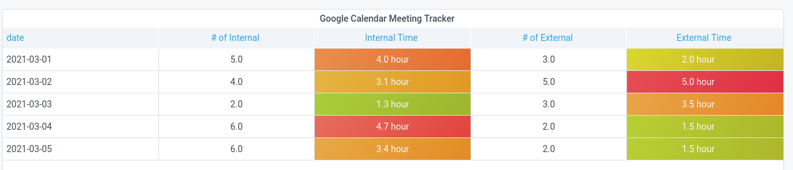

# prometheus-gcal-exporter

Scrapes Google calendar events, works out what is internal and what is
external, and exposes them as Prometheus Metrics.

This makes it easy to use from stuff like Grafana, like so; 

## Setup 

Get a client_secrets.json file .

1. Go to https://console.developers.google.com/apis/credentials
2. Setup a OAuth 2.0 Client ID.
3. Create credentials. You need to setup the app as a "desktop app".

## Config

Example /etc/prometheus-gcal-exporter/config.ini:

    clientSecretFile=/opt/client_secret.json
    updateDelaySeconds=300
    internalDomain=example.com

The container will run on port 8080/tcp by default. Metrics are available at
the standard /metrics prom endpoint.
