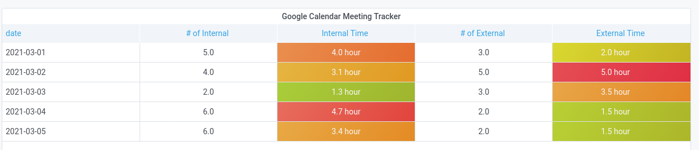

# prometheus-gcal-exporter

Scrapes Google calendar events, works out what is internal and what is
external, and exposes them as Prometheus Metrics.

This makes it easy to use from stuff like Grafana, like so; 



## Installation

```bash
docker create --name prometheus-gcal-exporter -p 8080:8080 ghcr.io/jamesread/prometheus-gcal-exporter:1.0.0
```

## Setup 

Get a client_secrets.json file .

1. Go to https://console.developers.google.com/apis/credentials
2. Setup a OAuth 2.0 Client ID.
3. Create credentials. You need to setup the app as a "desktop app".

## Config

Example /etc/prometheus-gcal-exporter/config.ini:

```ini
clientSecretFile=/opt/client_secret.json
updateDelaySeconds=300
internalDomain=example.com
lookbackDays=14
meetingClassPrefix=["triage=TRIAGE:", "incident=INC:", "customer=CX:"]
meetingClassColor=["focus=9"]
```

- `lookbackDays` — how many days of **past** events to scrape (default `14`).
- `meetingClassPrefix` — repeatable `className=PREFIX` rules; first case-insensitive title prefix match wins.
- `meetingClassColor` — repeatable `className=colorId` rules using Google Calendar `colorId` when no prefix matches.

Unmatched meetings are labeled `class="unclassified"`.

The container will run on port 8080/tcp by default. Metrics are available at
the standard /metrics prom endpoint.

## Metrics

| Metric | Labels | Meaning |
|--------|--------|---------|
| `gcal_mins_used` / `gcal_count` | `date` | Total meeting minutes / count |
| `gcal_mins_internal` / `gcal_count_internal` | `date` | Internal (no external attendees) |
| `gcal_mins_external` / `gcal_count_external` | `date` | External attendees present |
| `gcal_mins_available` | `date` | Assumed available minutes (480) |
| `gcal_mins_by_class` / `gcal_count_by_class` | `date`, `class` | Minutes / count by meeting class |
| `gcal_attendees` | `date`, `optionality`, `response` | Attendee RSVP counts (`mandatory`/`optional` × `accepted`/`declined`/`tentative`/`needsAction`) |

Gauges are rebuilt each scrape from the lookback window. Historical trends come from Prometheus storage (e.g. Grafana `sum_over_time`), not from an in-process counter.
